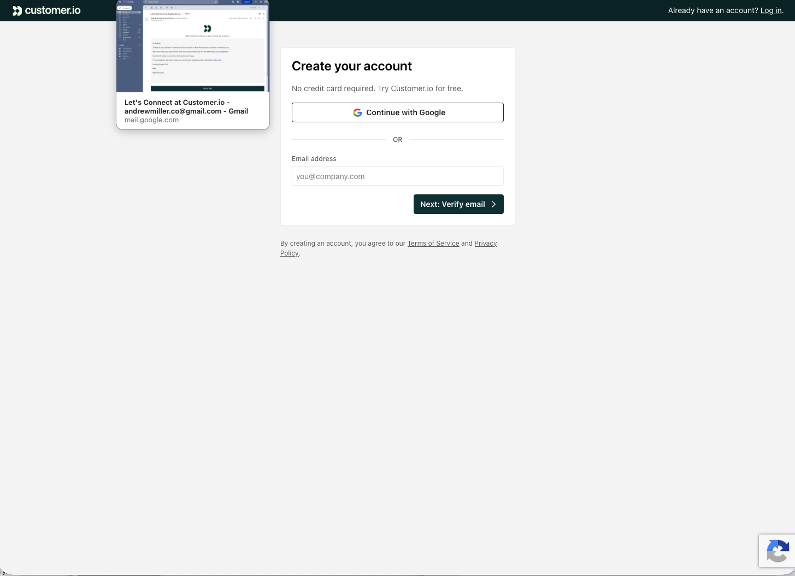
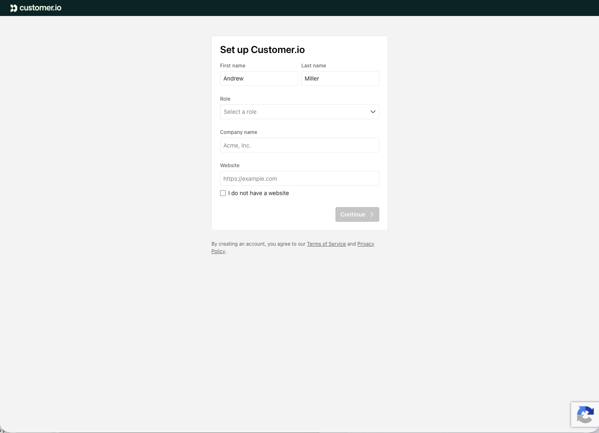
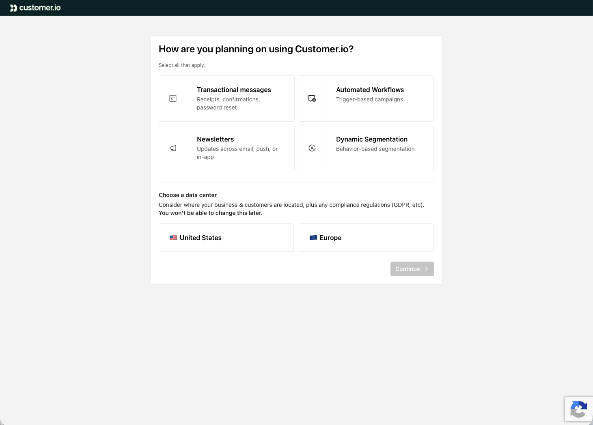
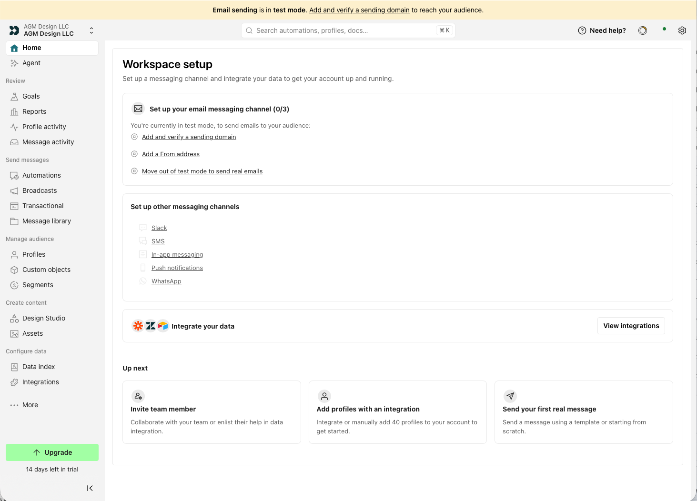
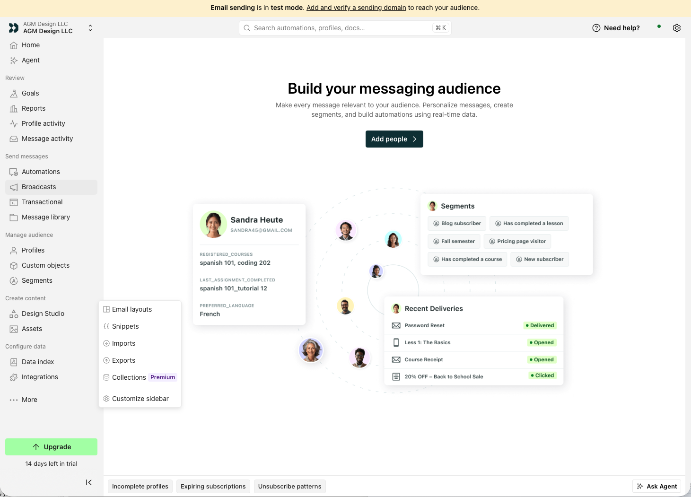
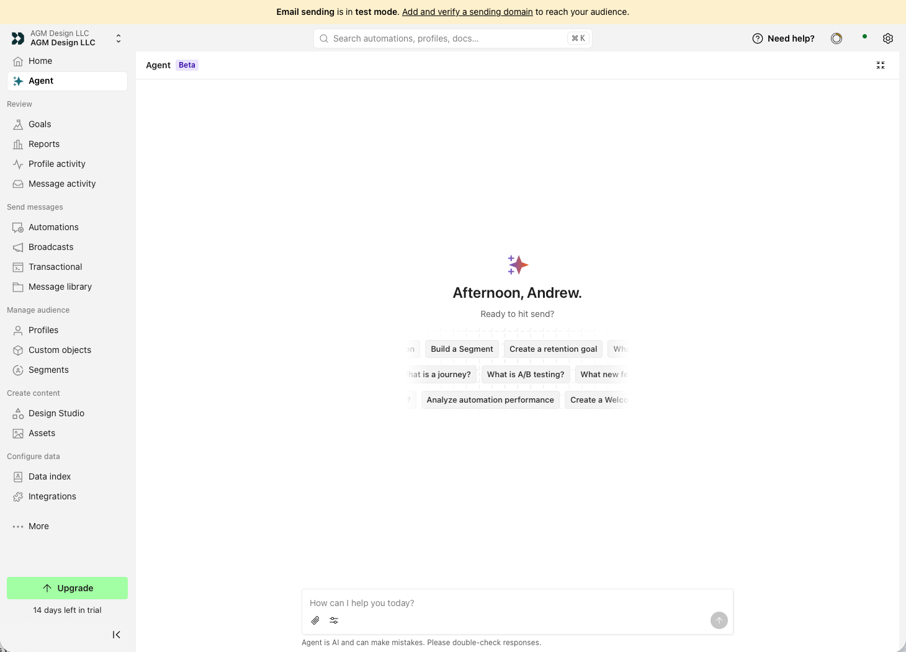
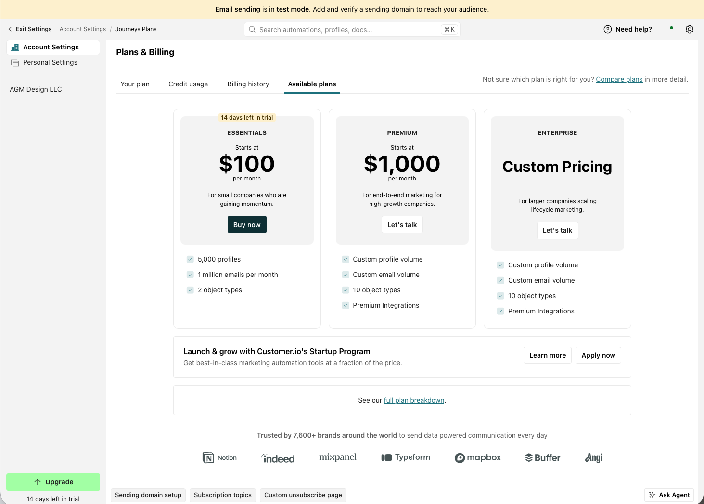
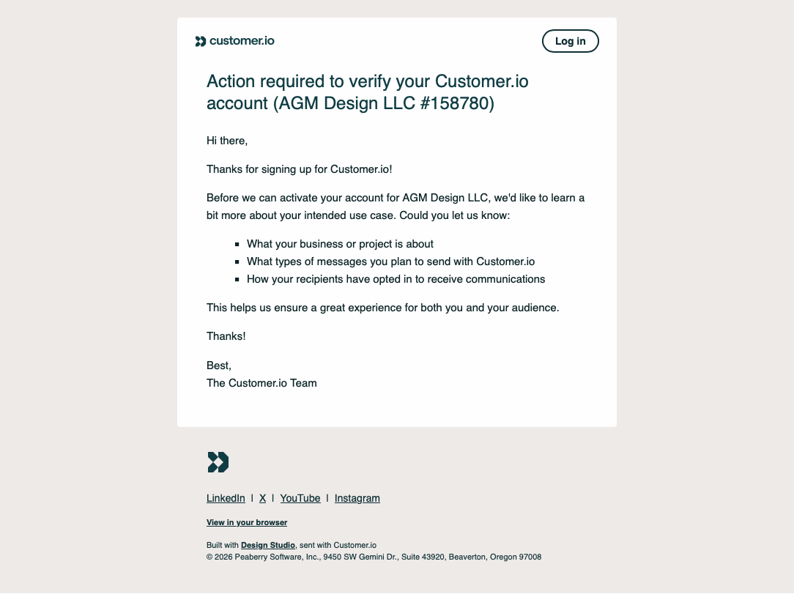

# Customer.io first-run activation audit

Date: July 21, 2026  
Scope: Trial signup through workspace setup, exploratory empty states, plan discovery, and account verification.

## Overall verdict

Customer.io's signup is visually clear and collects useful intent, but that intent is not visibly carried into the workspace. The first-run experience shifts from a guided sequence to a broad product shell with several equally plausible actions. The result is a continuity gap: the product knows what the user wants to accomplish, yet the home screen still asks the user to translate a generic setup checklist into their own path.

The strongest prototype opportunity is a personalized activation plan on Home. It should connect the selected use cases to a sequenced path, explain why each prerequisite matters, preserve progress across the product, and use the existing Agent as optional assistance rather than a separate destination.

## Flow audit

### 1. Create account — Healthy

- The single task and clear primary action keep the entry point understandable.
- "Next: Verify email" sets a useful expectation.
- The screenshot does not establish keyboard behavior, validation quality, or whether focus moves to errors.

### 2. Add personal and company context — Mixed

- Role, company, and website could support meaningful personalization later.
- The screen provides no visible progress indicator, back action, explanation of why the information is needed, or indication of which fields are required.
- The narrow form is easy to scan, but low-contrast labels and placeholder text should be checked against contrast requirements.

### 3. Select intended use and data region — Mixed

- Multi-select use cases are concrete and understandable. The irreversible data-center choice is called out.
- Use cases and infrastructure are combined in one step even though they require different kinds of decisions.
- The selected state relies heavily on a thin teal outline. A check indicator and programmatic selected state would make the choice easier to perceive.
- There is no visible explanation of how the selected use cases will change the experience.

### 4. Land on Workspace setup — Needs work

- The page correctly identifies sending configuration, data integration, and a first message as activation prerequisites.
- Signup intent is not reflected. A user who selected newsletters and automated workflows sees the same generic hierarchy.
- Three email subtasks are styled as similar text links; the page does not identify the single best next action, expected effort, owner, dependencies, or what can be done while domain verification is pending.
- "Up next" appears parallel even though inviting a teammate, adding profiles, and sending a real message have different dependencies.
- The persistent Upgrade control receives more visual emphasis than the activation tasks before value has been reached.

### 5. Explore pre-activation empty states — Mixed

- Aspirational examples explain the eventual value of each area.
- Product navigation allows users to reach many attractive but premature destinations. Calls to create campaigns, goals, or segments can compete with unresolved sending and data prerequisites.
- The system needs a shared readiness pattern so every destination can explain what is possible now, what is blocked, and how to return to setup.

### 6. Open Agent — Needs work for first-run users

- The Agent is prominent and consistent with Customer.io's current product positioning.
- Its blank first-run state does not visibly use the account's setup status or selected goals. Generic suggestion chips compete with the deterministic activation work already known by the system.
- A better pattern would offer a reversible setup plan, show what the Agent can do versus what requires the user, and preview any changes before applying them.

### 7. Investigate upgrade options — Mixed

- Pricing and core limits are visible, and the startup program provides a useful alternative path.
- The page asks the user to compare tiers before showing which capabilities matter for their selected use case or current progress.
- The jump from Essentials to Premium is substantial, but the page does not connect that difference to a concrete workflow outcome.
- Upgrade messaging would be more credible after the user has built a first journey or encountered a relevant capability boundary.

### 8. Receive account verification request — Needs work

- The message explains why review is required and asks about consent, which is important for platform trust and deliverability.
- It repeats information partly gathered during signup and does not present a clear response control, expected review time, saved status, or visible route back to the exact task.
- "Log in" is visually actionable, but the required action appears to be replying with information. That ambiguity can stall activation.

## Recommended prototype

### Personalized activation plan

Replace the generic Home hierarchy with a focused plan titled around the user's chosen outcome, for example: **Launch your first automated newsletter**.

The prototype should demonstrate:

1. A persistent activation plan generated from signup choices.
2. One recommended next action with purpose, estimated effort, dependencies, and completion state.
3. A contextual coach mark that opens the sending-domain task without covering the rest of the page.
4. A safe Agent assist: explain DNS records, draft a plan, or check readiness, but preview changes and clearly identify actions the user must complete.
5. A waiting state for domain verification with productive parallel work, such as importing test profiles or drafting content.
6. A completion transition from setup to a first test send.
7. A contextual upgrade explanation only when the user's intended workflow needs a paid capability.

## Why this concept fits the role

This is a flow and system intervention, not a decorative reskin. It addresses onboarding, activation, recovery, prerequisite states, AI uncertainty and reversibility, design-system reuse, and an interaction that can be implemented and tested in code—the exact capabilities emphasized in the Senior Product Designer role.

## Success measures

- Time to verified sending domain
- Setup-plan completion rate
- Percentage of trial workspaces that import a profile and send a test message
- Return and resume rate after domain verification begins
- Agent-assisted task completion versus abandonment
- Upgrade exploration after an activated workflow, with guardrails against reducing activation

## Evidence limits

This audit is based on supplied desktop screenshots and the public Customer.io site and role description. It does not establish actual funnel performance, technical constraints, focus order, screen-reader output, responsive behavior, error handling, loading behavior, or whether different signup selections currently produce different experiences. Those should be validated before treating the hypothesis as a shipping recommendation.
